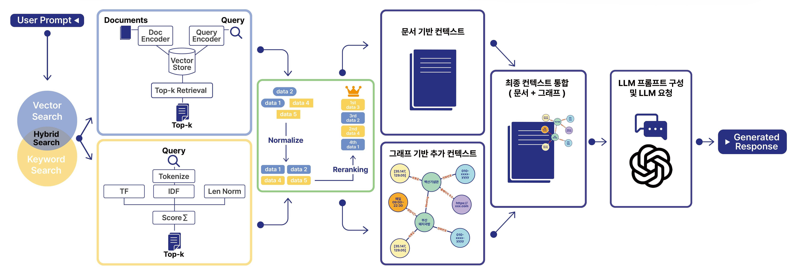

# Agentic AI Busan

## 프로젝트 소개
**Agentic AI Busan**은 **고급 검색(Advanced RAG) 및 모듈식 RAG(Modular RAG) 기술**을 활용하여 부산 여행 정보를 제공하는 AI 기반 서비스입니다. 사용자의 복잡하고 다양한 질문 의도를 파악하여, 부산의 맛집, 관광 명소 등에 대한 맞춤형 정보를 자연스러운 대화 형태로 제공함으로써 부산 여행 계획을 지원합니다.
이 프로젝트는 초기 Naive RAG 시스템에서 발전하여, 더욱 정확하고 풍부한 정보를 제공하는 것을 목표로 합니다.
이 프로젝트는 [OKESTRO AGI(주)](https://www.lifelogm.co.kr/index.html)의 지원을 받았습니다.

## 주요 기능
*   **Advanced RAG:**
    *   **Hybrid Search:** 키워드 기반 검색(BM25)과 의미론적 벡터 검색을 결합하고, TMM-CC 정규화를 통해 검색 정확도를 극대화합니다. (현재 가중치 α=0.8 적용)
    *   **Reranking:** `cross-encoder/ms-marco-MiniLM-L-6-v2`모델을 사용하여 초기 검색 결과를 사용자 질문과의 관련성이 높은 순으로 재정렬하여 LLM에 더 정제된 컨텍스트를 제공합니다.
*   **Modular RAG:**
    *   **Multi-Vector Store:** 식당, 관광지 등 도메인별 특화된 FAISS 벡터 DB를 구축하여 전문적이고 정확한 정보를 제공합니다.
    *   **Query Router:** LLM(`gpt-4o-mini` 활용)이 사용자 질문과 대화 맥락을 분석하여, 질문 의도를 'restaurant', 'attraction', 'general' 등의 카테고리로 자동 분류하고 최적의 정보 소스 및 서비스로 요청을 전달합니다.
    *   **Graph RAG:** `NetworkX`로 구축된 지식 그래프를 활용합니다. 벡터 검색 결과에서 추출된 주요 개체(장소, 메뉴 등)와 지식 그래프상의 관계를 파악하여, LLM에 더욱 풍부하고 맥락적인 정보를 제공함으로써 답변의 깊이를 더합니다. (예: 특정 식당 주변 관광지, 메뉴 상세 정보 등)
*   **Streamlit 기반 챗봇 UI:**
    *   사용자 친화적인 웹 인터페이스를 통해 실시간으로 AI와 대화하며 부산 여행 정보를 얻을 수 있습니다.

## 시스템 아키텍처

본 시스템의 핵심 아키텍처는 다음과 같은 흐름으로 사용자에게 답변을 제공합니다:

1.  **User Prompt 입력**: 사용자가 챗봇을 통해 자연어로 질문을 입력합니다.
2.  **Hybrid Search**:
    *   **Vector Search**: 사용자 질문을 임베딩하여 FAISS Vector Store에 저장된 문서들과의 의미적 유사도를 기반으로 상위 K개의 문서를 검색합니다.
    *   **Keyword Search**: 사용자 질문에서 키워드를 추출하고, TF-IDF 점수화 방식을 통해 문서 내 키워드 일치도를 기반으로 상위 K개의 문서를 검색합니다.
3.  **Normalize & Reranking**: 벡터 검색과 키워드 검색 결과를 통합하고 정규화한 후, Cross-Encoder 모델을 사용하여 사용자 질문과의 관련성이 높은 순서대로 문서들을 재정렬합니다.
4.  **Context Integration**:
    *   **Document-based Context**: 재순위화된 핵심 문서 내용을 컨텍스트로 구성합니다.
    *   **Graph-based Additional Context**: 검색된 문서에서 주요 엔티티(장소, 인물 등)를 추출하고, 사전에 구축된 Knowledge Graph에서 해당 엔티티와 관련된 추가 정보(주변 정보, 특징, 관계 등)를 탐색하여 컨텍스트를 더욱 풍부하게 만듭니다.
5.  **LLM Prompting & Request**: 통합된 문서 및 그래프 기반 컨텍스트와 사용자 질문을 바탕으로 LLM(GPT-4o mini)이 이해하기 쉬운 형태로 프롬프트를 구성하여 요청합니다.
6.  **Generated Response**: LLM이 구성된 프롬프트를 바탕으로 최종 답변을 생성하여 사용자에게 전달합니다.

이러한 RAG 파이프라인은 주로 **`ai-server`** 내에서 실행되며, **`ai-preprocessing`** 단계에서 생성된 벡터 DB와 지식 그래프를 활용합니다. 사용자는 **`streamlit-app`**을 통해 이 시스템과 상호작용합니다.

## 기술 스택
*   **Backend & AI/ML:**
    *   Python 3.10+
    *   FastAPI: API 서버 구축
    *   LangChain: RAG 파이프라인, LLM 연동 및 프롬프트 관리
    *   OpenAI API (`gpt-4o-mini` 등): 자연어 이해, 생성 및 임베딩
    *   FAISS: 벡터 검색 및 저장소
    *   NetworkX: 지식 그래프 구축 및 관리
    *   Sentence Transformers (`cross-encoder/ms-marco-MiniLM-L-6-v2`): Reranker 모델
    *   BM25: 키워드 검색
*   **Micro Frontend:**
    *   Streamlit: 대화형 챗봇
*   **DevOps & Tools:**
    *   Docker & Docker Compose: 컨테이너화 및 서비스 오케스트레이션
    *   GitHub: 버전 관리
*   **데이터 소스:**
    *   [**부산관광공사 부산 음식테마거리**](https://data.busan.go.kr/bdip/opendata/detail.do?publicdatapk=15096646&searchKeyword=%EB%B6%80%EC%82%B0%EC%9D%8C%EC%8B%9D%ED%85%8C%EB%A7%88%EA%B1%B0%EB%A6%AC&searchOption=OR&from=dsh&uuid=181134f2-5d6a-42bb-b813-8932abc94847)
    *   [**부산관광공사 7 BEACH**](https://data.busan.go.kr/bdip/opendata/detail.do?publicdatapk=15096697&searchKeyword=7beach&searchOption=OR&uuid=c38581ed-925c-44a8-a0a7-f993b8bd5aad)
    *   [**부산광역시 부산명소정보**](https://data.busan.go.kr/bdip/opendata/detail.do?publicdatapk=15063481&searchKeyword=%EB%B6%80%EC%82%B0%20%EB%AA%85%EC%86%8C&searchOption=OR&uuid=4b435728-23f2-4bae-a236-791295496b57)

## 프로젝트 문서

보다 자세한 기술 구현 내용은 다음 문서들을 참고해주세요:

*   **RAG 구현:**
    *   `docs/naive_rag_implementation.md`: 초기 Naive RAG 구현 설명
    *   `docs/advanced_rag_implementation.md`: Hybrid Search, Reranking 등 Advanced RAG 구현 상세
    *   `docs/modular_rag.md`: Query Router, Multi-Vector Store, Graph RAG 등 Modular RAG 아키텍처 및 구현 상세
*   **챗봇 및 기타:**
    *   `docs/streamlit_chatbot_guide.md`: Streamlit 기반 챗봇 UI 개발 가이드
    *   `docs/query_extentions.md`: 사용자 요청 파라미터 기반 동적 쿼리 생성 방식
    *   `docs/JsonParser.md`: LLM 응답 파싱 및 검증 시스템

## 향후 계획

다음 기능들은 현재 계획 단계에 있으며, 향후 업데이트를 통해 추가될 수 있습니다:

*   **에이전트 시스템 (Agent System):** 날씨 API, 지도 API 등 외부 도구 및 API, MCP와 연동하여, 단순 정보 제공을 넘어 여행 일정 추천, 예약 지원 등 보다 능동적인 기능을 제공합니다.
*   **지원 도메인 확장:** 숙소, 교통, 축제, 쇼핑 정보 등 부산 여행과 관련된 더욱 다양한 정보를 통합합니다.
*   **다국어 지원:** 외국인 관광객을 위한 다국어 지원 기능을 추가합니다.

## 개발자 정보
<table>
    <tr height="160px">
        <td align="center" width="160px">
            
             
            <a href="https://github.com/KJ-Min"><strong>민경진</strong></a>
             
        </td>
        <td>
            <strong><프로젝트 기여></strong> 
            • 약 60K 음식점 벡터 데이터베이스 구축 및 전처리 
            • LLM 리서치 (RAG, Agent, Prompt Engineering) 
            • Advanced RAG 및 Modular RAG 시스템 설계 및 핵심 로직 구현 (하이브리드 검색, 리랭커, 쿼리 라우터, Graph RAG) 
            • FastAPI 기반 API 서버 개발 및 서비스 로직 구현 
            • 전체 시스템 아키텍처 설계 및 통합
            • Streamlit 기반 챗봇 UI 프로토타입 개발
        </td>
    </tr>
</table>
<table>
    <tr height="160px">
        <td align="center" width="160px">
            
             
            <a href="https://github.com/JeongTJ"><strong>정태준</strong></a>
             
        </td>   
        <td>
            <strong><프로젝트 기여></strong> 
            • 관광지 데이터 수집, 전처리 및 벡터 데이터베이스 구축 
            • RAG 시스템 백엔드 API 개발 및 관리 지원 (Prompt Engineering, Query Expansion 포함) 
            • Docker 및 Docker Compose 기반 개발 환경 구축 및 컨테이너 관리 
            • RAG 파이프라인 구현 및 테스트 기여 
            • GitHub Actions를 활용한 CI/CD 환경 구축
        </td> 
    </tr>
</table>

---

*이 프로젝트는 지속적으로 발전하고 있으며, 모든 기능은 현재 구현 상태를 기준으로 설명되었습니다.*